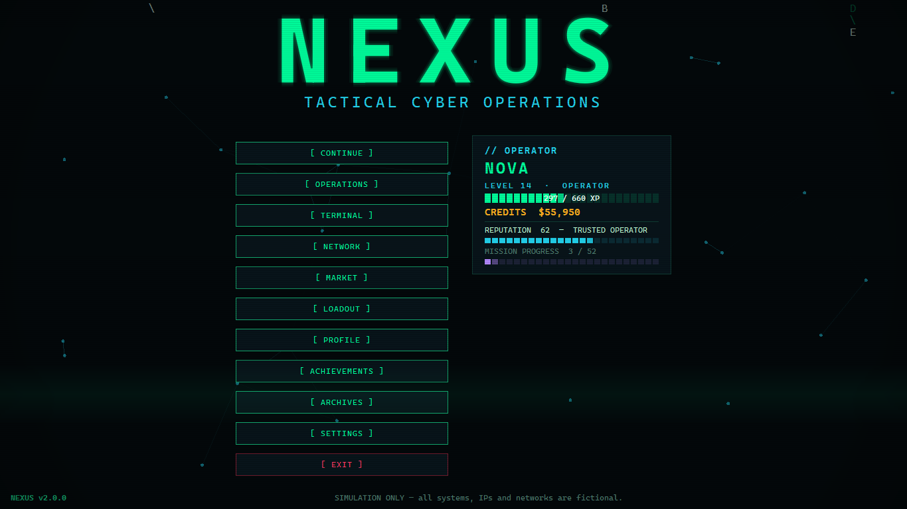
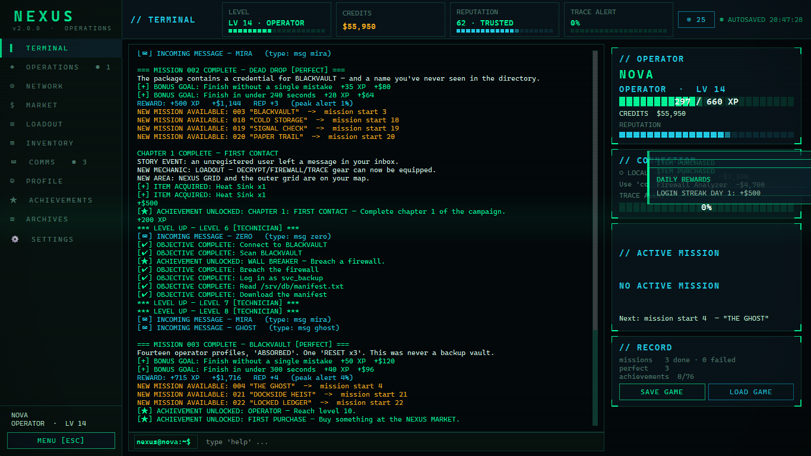
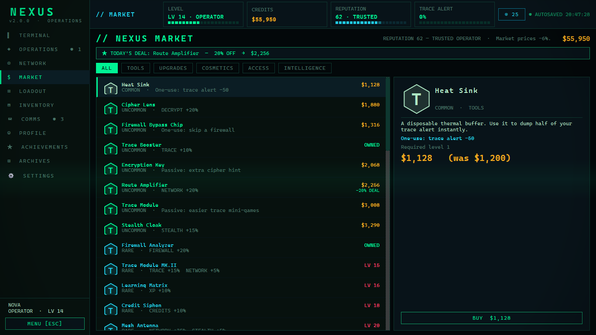
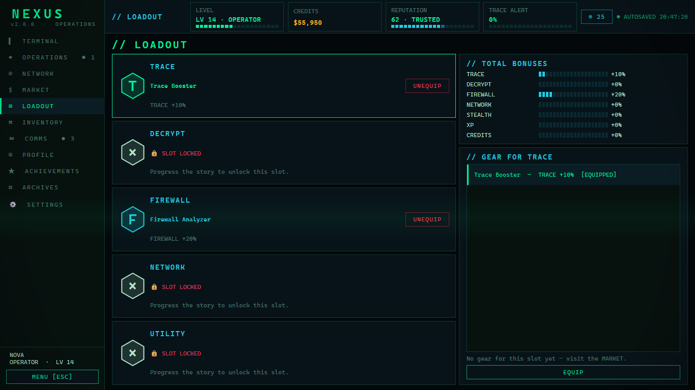
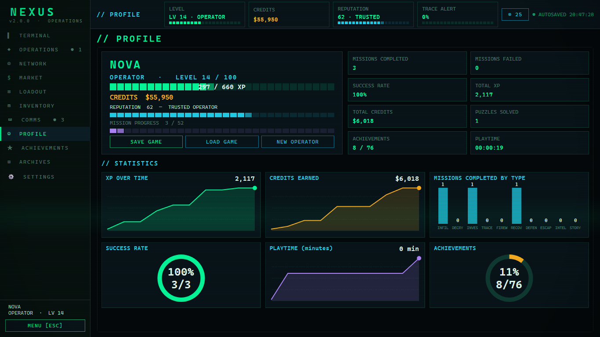
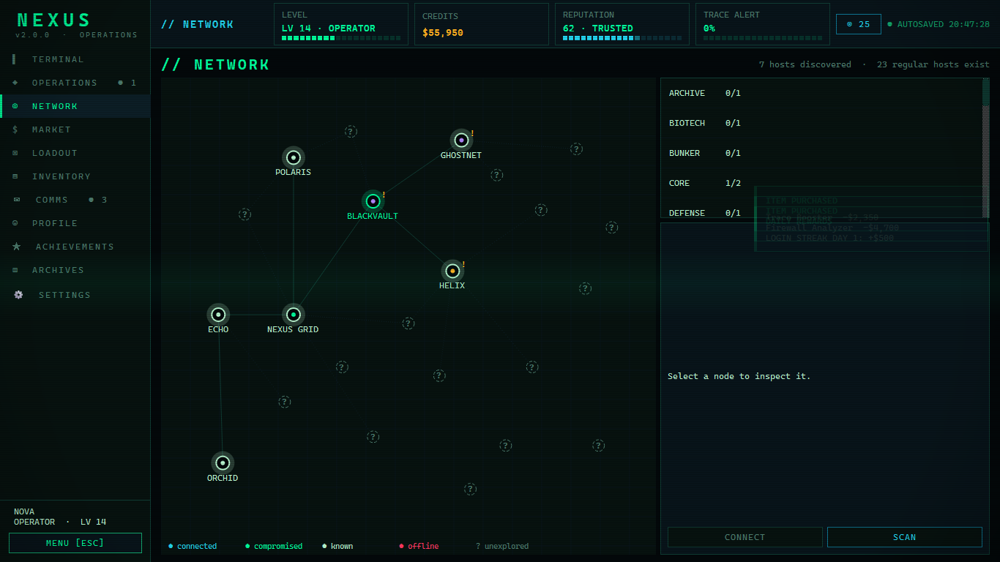
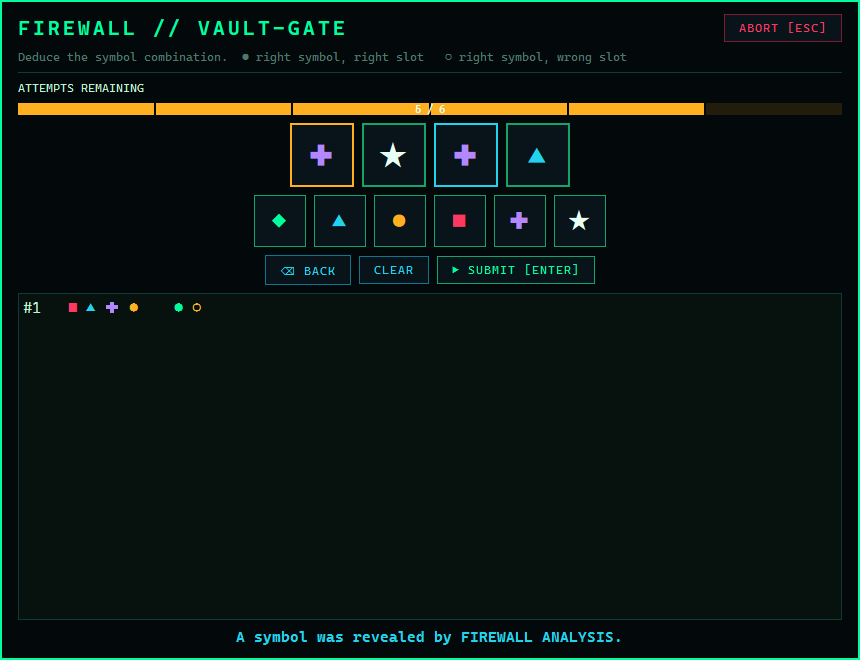
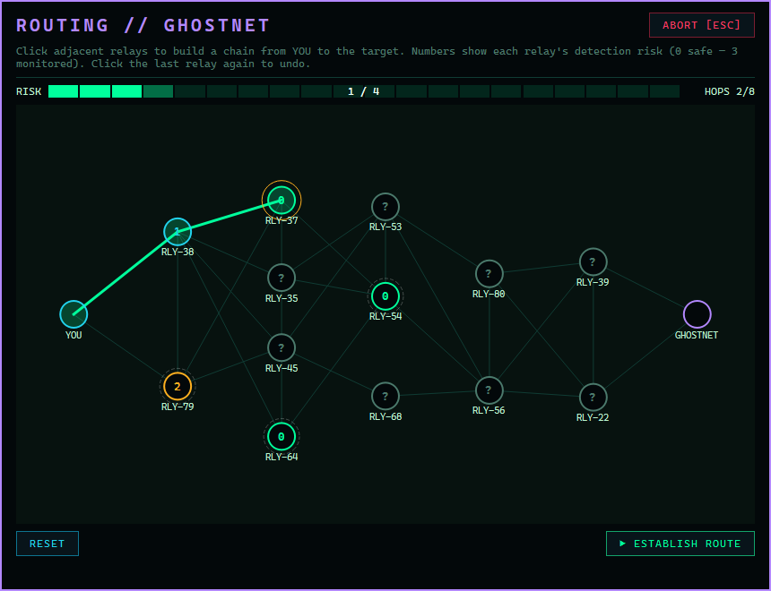

# NEXUS

### TACTICAL CYBER OPERATIONS — v3.0.0

**Created by Toto.**  Community / Discord: see the *About* tab in Settings (the link is set in `nexus/version.py`).

> *The networks never sleep. Neither does NEXUS.*

NEXUS // TERMINAL is a single-player cyberpunk operations game for Windows (Python + PySide6).
You are a freshly recruited NEXUS operator. You work through a 52-mission campaign of fully simulated cyber
operations, build an economy, equip gear, climb 100 levels — and slowly discover that NEXUS is not what it claims to be.

**Everything is a simulation.** All servers, IP addresses (`10.42.x.x`), files, users, firewalls and networks exist
only inside the game. NEXUS never opens a network connection, never scans anything and never touches a real system
(see [Security & sandbox](#security--sandbox)).

| Main menu | Terminal & HUD |
|---|---|
|  |  |
| NEXUS Market | Loadout |
|  |  |
| Profile & statistics | Network map |
|  |  |
| Firewall puzzle | Routing puzzle |
|  |  |

---

## Features

**Game**
* **52 missions in 6 story chapters** (FIRST CONTACT, THE GRID, BLACKVAULT, ZERO, THE ARCHITECT, NEXUS) — 16 story missions, 28 side missions and 8 secret missions. Ten mission types (infiltration, decryption, investigation, trace, firewall, recovery, defense, escape, intelligence, story), five difficulties (EASY … NEXUS), bonus objectives, bonus goals (time / no mistakes), timed missions, decisions with consequences and **5 endings** (one secret).
* **Five mini-games**, each with its own UI: Firewall, Encryption (Caesar / Atbash / Vigenère), Routing, Access Code, Trace.
* **Chapter finales** with story events, new mechanics (loadout slots), items and newly revealed areas.
* **ZERO** — a mysterious user whose messages change with your progress; hidden logs, secret commands, hidden servers, secret missions (SPECTER, VOID, GENESIS) and alternative endings.
* **26 simulated servers** with virtual IPs, ports, firewalls, users, file systems, logs, hidden files and secrets; a visual **network map** that unlocks with progress.

**New in 3.0 — NEXUS CAMPAIGN 3.0 (BETA)**
* A whole second game-in-the-game, reachable from the main menu, independent of the classic campaign above (which
  is untouched and stays the default). **200 hand-written levels across 9 acts**, no mini-games — you type real
  commands into a real **bash, PowerShell or cmd shell** (pipes, redirection, variables, scripts, history, tab
  completion, `man`/`--help`/`Get-Help`, real file permissions, `ssh`/`scp` between machines) against a fully
  simulated network, Windows targets included, with a real story and four endings (one secret).
* Guided / Medium / Hardcore help modes, a searchable command **Lexicon**, replay any mission or generate endless
  procedural ops after level 200, plus a **Daily Op** — the same seeded challenge for every player, every day.
* A shareable **profile card** (PNG), a **mission map** graph of your progress across all 9 acts, music and sound
  for the campaign, and optional **call-style story scenes** for key beats.
* German localization in progress (Acts I-III done so far).
* A real, optional **3D network map** (Settings → Display) alongside the existing flat one, with an automatic
  fallback if 3D can't load on your machine.
* Accessibility: reduced motion, a showcase/streaming mode that masks your callsign, and two new themes
  (COLORBLIND SAFE, MONOCHROME).

**New in 2.1**
* **Endless contracts** — procedural jobs (infiltration, recovery, decryption, trace, escape) scaled to your level, after mission 003. `contract new` / `contract start`, or the CONTRACTS tab.
* **Difficulty** easy / normal / hard (`difficulty`, or Settings → Gameplay) and **New Game+** (`newgameplus`) that keeps level, items and achievements.
* First-time **how-to-play tips** for every mini-game, a **HIGH CONTRAST** theme, text size up to 24, **F12 screenshots**, *Open error log* / *Open save folder* buttons.

**Online (optional, v2.2)** — Discord login, leaderboards and a friends list with live status via your own server.
See [docs/ONLINE.md](docs/ONLINE.md). Without a configured server the game makes no online connection for this.

**Progression & economy**
* **100 levels**, 8 ranks (SCRIPT KIDDIE → TECHNICIAN → OPERATOR → SPECIALIST → ELITE → NEXUS → ARCHITECT → NEXUS PRIME) with a big level-up animation that lists new rank / item / mission unlocks.
* **NEXUS MARKET**: tools, upgrades, cosmetics, access, intelligence — six rarities (COMMON … NEXUS), level requirements, a daily deal, reputation-based prices.
* **Loadout**: five gear slots (TRACE, DECRYPT, FIREWALL, NETWORK, UTILITY) with percentage stats that change the mini-games.
* **Daily operations** with a 7-day login streak, **weekly challenges**, 7 upgrade tracks, reputation (UNPROVEN … LEGEND) that affects prices, missions and NPC attitudes.
* **76 achievements** in 7 categories, a statistics dashboard with charts, an operator profile and 7 unlockable **terminal themes** that restyle the whole UI.

**Application**
* Sidebar navigation (Terminal, Operations, Network, Market, Loadout, Inventory, Comms, Profile, Achievements, Archives, Settings), top bar with status cards, notification centre, animated toasts and cinematic banners.
* Professional first-launch experience (system check, profile creation) and an **interactive tutorial**.
* English and German interface, settings for volume, text speed, animations, CRT/glitch effects, fullscreen, resolution, theme and language.
* Procedurally generated sound effects and ambient drone (no audio assets required).
* Autosave (SQLite) + 3 manual save slots; **old saves are migrated automatically** (a `.bak` copy is kept).

## Installation (Windows)

### Option A — Installer (recommended)
1. Download **`NEXUS-Setup.exe`** from the [GitHub Releases](../../releases) page.
2. Run it, choose a folder, finish. It creates a Start-menu entry and (optionally) a desktop shortcut.
3. Start **NEXUS** from the desktop or the Start menu. Uninstall from *Windows Settings → Installed apps*.

### Option B — Portable EXE
Download/unzip the `NEXUS` folder and double-click **`NEXUS.exe`**. No Python needed. Saves live in `NEXUS\saves`.

### Option C — From source (development)
Requirements: Windows 10/11, Python **3.12+**, [PySide6](https://pypi.org/project/PySide6/).

```text
git clone <your-fork-url> NEXUS
cd NEXUS
start.bat                  # creates .venv, installs requirements, launches
```
or manually:
```text
py -3 -m venv .venv
.venv\Scripts\python -m pip install -r requirements.txt
.venv\Scripts\python main.py
```

No online services, accounts or internet connection are needed.

## How to play

On the very first start NEXUS runs a system check and asks for your operator name. Mission 001 starts automatically
and an interactive tutorial walks you through the interface. From then on:

* **Terminal** — the heart of every mission (`help`, `mission`, `connect`, `scan`, `firewall`, `login`, `cat`, `download` …).
* **Operations** — all missions by chapter, plus daily operations and weekly challenges.
* **Market / Loadout / Inventory** — spend credits, equip gear, use items, buy upgrades.
* **Network** — the map of everything you have discovered; unexplored hosts show as `?`.

### Terminal commands

`help about difficulty contract newgameplus clear status whoami pwd ls cd cat open rm download upload map network ping scan route connect disconnect login logout firewall trace decrypt decode mission missions choose hint train inventory use contacts msg upgrades upgrade market shop buy loadout equip unequip profile achievements stats daily weekly theme history tutorial save load menu settings exit`

`ls -a` shows hidden files. `help <command>` explains any command. Some commands are secret.

### Controls

| Key | Action |
|---|---|
| `Enter` / `Tab` / `Up` `Down` | Run command / complete / history |
| `Enter` or `Space` while text animates | Skip the animation |
| `Ctrl+L` | Clear terminal |
| `Esc` | Pause menu |
| `Ctrl+1` … `Ctrl+9` | Jump to a page (Terminal, Operations, Network, Market, Loadout, Inventory, Comms, Profile, Achievements) |
| `F1` | `help` |
| `F5` / `Ctrl+S` | Quick save (slot 1) |
| `F9` | Load menu |
| `F11` | Toggle fullscreen |

## Architecture

```
NEXUS/
├── main.py                  entry point
├── nexus/                   game logic (no widgets)
│   ├── version.py           single source of the version number (2.0.0)
│   ├── config.py            paths, palette, ranks (100 levels), XP curve, defaults
│   ├── database.py          SQLite layer + schema migrations (v1 -> v2)
│   ├── save_system.py       profiles, manual slots, settings store
│   ├── player.py            level / XP / credits / inventory / upgrade + gear effects
│   ├── market.py            catalogue, pricing, purchasing, loadout rules
│   ├── progress.py          daily operations, login streak, weekly challenges
│   ├── reputation.py        reputation statuses and price modifiers
│   ├── simulation.py        virtual servers, file systems, session state
│   ├── mission_engine.py    event-driven mission state machine, bonus goals, gating
│   ├── game_engine.py       orchestrator, level-ups, chapters, notifications (Qt signals)
│   ├── commands.py / command_game.py / command_meta.py   terminal commands (generators)
│   ├── minigames.py         puzzle logic          events.py   random events + ZERO stages
│   ├── achievements.py      data-driven achievements    eggs.py   secret commands
│   ├── audio.py             synthesised sounds    i18n.py   EN/DE strings    security.py   sandbox guard
├── ui/                      PySide6 interface
│   ├── main_window.py       application flow, overlays, shortcuts, themes
│   ├── app_shell.py         sidebar + top bar + page stack
│   ├── terminal_page.py / terminal.py / dashboard.py
│   ├── operations_page.py / mission_screen.py   market_page.py   loadout_page.py   inventory.py
│   ├── map_view.py   contacts_panel.py   profile_page.py + charts.py   achievements_page.py
│   ├── archives.py   settings.py   first_launch.py   tutorial.py   minigames.py   widgets.py ...
├── data/                    servers, servers_extra, users, commands, items, market, themes, chapters,
│                            challenges, achievements, events, endings, secrets, zero (JSON)
├── missions/                mission_001.json ... mission_052.json
├── assets/                  nexus.ico / .png / .svg, sounds/ (generated), fonts/ (optional)
├── installer/               NEXUS-Setup.exe sources (IExpress + PowerShell wizard)
├── tools/                   content generator, icon and version-resource scripts
└── tests/                   unit, campaign, all-52-missions and UI integration tests
```

**Key idea:** terminal commands are *generators* that yield output objects (`Out`, `Progress`, `Minigame`, `Prompt`,
`Banner` …). The terminal widget animates them; the headless test driver replays them instantly. Because of that, all
52 missions are covered by an automated test that plays them from start to finish.

### Content pipeline
Story missions (001–016) are hand-written JSON. Side and secret missions (017–052) and the 13 extra servers are produced
by `python tools/build_content.py` from `tools/content_data.py`. Re-run it after editing that file.

## Mission system

Every mission defines id, title, type, difficulty, chapter, required level / reputation / items, story text, ordered
objectives, optional bonus objectives, bonus goals (`time_under`, `no_losses`, `max_heat`), optional time limit and
decisions (`choice`) with outcomes. Objectives complete when the matching gameplay event fires (`connect`, `scan`, `ls`,
`read`, `download`, `upload`, `login`, `firewall`, `route`, `decrypt`, `trace`, `decode`, `topic`, `use`, `item`, `flag`,
`disconnect`, `heat_below`). Ratings: **PERFECT** (peak trace alert ≤ 25 % and no failed mini-game, ×1.25 rewards) or **SUCCESS**.

## Save system

* Every operation is one SQLite file in `saves/profiles/`, autosaved continuously.
* **Save Game** snapshots into one of 3 manual slots (`saves/slots/`); **Load Game** restores a slot over its profile.
* **Migration:** saves from v1.x are upgraded in place on first load (new tables for loadout, history, unlocks and
  notifications). A backup `profile.v1.bak` is written next to the save first, and nothing is deleted.
* Settings are stored in `saves/settings.json`.

## Security & sandbox

* All hosts are fictional `10.42.0.0/16` addresses defined in `data/`.
* The terminal refuses real-looking IPs and host names (`ADDRESS OUTSIDE SIMULATION SANDBOX`).
* "scan", "firewall", "login", "trace" … are game mechanics operating on SQLite/in-memory data.
* `tests/test_core.py` statically audits the code and fails if `socket`, `requests`, `urllib`, `subprocess` (and similar) are ever imported.

## Development

```text
start.bat                                              run from source
python -m unittest discover -s tests -t .              67 automated tests (logic, all 52 missions, migration, market ...)
python tests\ui_flow.py                                UI integration test (needs a desktop session)
python tests\ui_campaign.py                            UI test: boot camp + missions 1-6 through the real terminal
python tests\ui_v2.py                                  renders every page to PNG screenshots
python tools\build_content.py                          regenerate side missions + extra servers
```

## Build & Release

```text
build_exe.bat                  ->  dist\NEXUS\NEXUS.exe             (PyInstaller, includes icon + version resource)
build_exe.bat installer        ->  also dist\NEXUS-Setup.exe        (self-extracting installer with wizard)
```

Release checklist:
1. Bump `nexus/version.py` (`VERSION = "x.y.z"`) — menu, window resources, installer and uninstaller pick it up.
2. Run the tests, then `build_exe.bat installer`.
3. Smoke-test `dist\NEXUS\NEXUS.exe` and `dist\NEXUS-Setup.exe` on a clean machine.
4. Create a GitHub release `vX.Y.Z` and attach `NEXUS-Setup.exe` (and a zip of `dist\NEXUS` for the portable version).

The built application contains no absolute paths; saves, settings and generated sounds are created next to the EXE.

## Updates (automatic, via GitHub Releases)

NEXUS can check GitHub on startup and require installed copies to update. It is **off until you configure it**.

1. Create a **public** GitHub repository and push this project.
2. In `nexus/version.py` set `GITHUB_REPO = "your-name/your-repo"` (and `UPDATE_REQUIRED = False` if updates should be optional).
3. Release: bump `VERSION`, commit, then `git tag v2.2.0` and `git push --tags`. The workflow in `.github/workflows/release.yml`
   runs the tests, builds `NEXUS-Setup.exe` and publishes it (with a `.sha256` checksum) as a GitHub release.
   (Or build locally with `build_exe.bat installer` and upload `dist\NEXUS-Setup.exe` to a release by hand.)
4. Every older installed game shows an **Update** dialog at startup, downloads the installer, verifies the checksum and
   opens it; the installer updates the existing installation in place and keeps all saves. Offline players can still play.

Privacy/security: `nexus/updater.py` (updates) and `nexus/online.py` (optional online service, opt-in) are the only modules that touch the network. It talks to `github.com` over HTTPS only
(redirects included), reads the latest release and downloads its installer. It sends no game or personal data. The tests
fail if network code appears anywhere else. Games run from source are never nagged.

## Roadmap

* Procedural contracts for endless free play after the campaign
* New Game+ with the memory of the secret ending
* More chapters, servers and a hardware-themed upgrade tree
* Controller / accessibility options (high-contrast theme, screen-reader mode)
* More languages
* Community mission-pack loader

## Contributing

Issues and pull requests are welcome.

1. Fork, create a branch, keep changes focused.
2. Add or update tests; run `python -m unittest discover -s tests -t .` before submitting.
3. New content is mostly JSON (servers, missions, achievements, market items, events). Keep every address inside
   `10.42.0.0/16`; the sandbox test enforces this. For side missions edit `tools/content_data.py` and regenerate.
4. Never add networking code.

## License

MIT — see [LICENSE](LICENSE).
